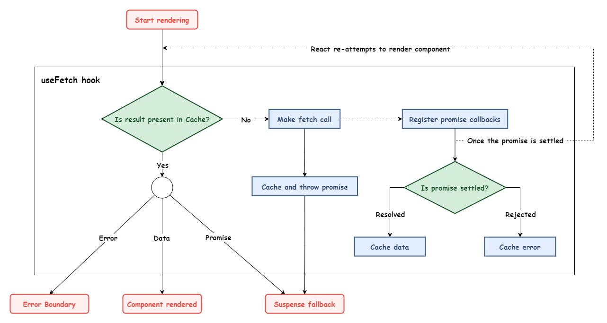

# react-suspense-fetch

Simple primitive hook for fetching data with react suspense.

# About

`render-as-you-fetch` has been the talk of the town as the latest data fetching pattern in React.

It complements and leverages the React Suspense capabilities to provide a smooth developer and user experience.

I have created a primitive React hook to understand `render-as-you-fetch` pattern.

# Hook flow

## License

Zero BSD © Piyush Lodaya
